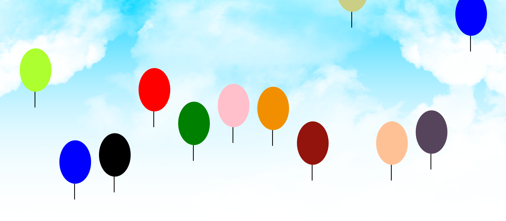

# SkyPop: The Ultimate Balloon Adventure



**SkyPop** is a fast‑paced browser game that challenges your agility and timing. Navigate through the skies and try to pop as many balloons as you can before they float beyond reach. Each balloon has its own speed and path, keeping every round fresh and exciting.

## Gameplay

- **Pop balloons** by clicking on them before they drift off the top of the screen.
- **Hear the pop!** Each balloon plays a popping sound when clicked.
- **Win/Lose conditions:** Pop all balloons to win. If a balloon reaches the top of the screen, the game ends.

## Running the Game

1. **Download or clone this repository** to your local machine.
2. Open `index.html` in a modern web browser (Chrome, Firefox, etc.).
3. Make sure the `assets`, `css` and `js` folders remain in the same directory as `index.html`.

No additional installation or build steps are required—the game runs directly in your browser.

## Controls

- **Click the balloons** to pop them.
- After the game ends, press **Enter** or click the **Start Over** button to play again.

## Project Structure

```
.
├── index.html         # Main HTML file
├── css/
│   └── main.css       # Styles for balloons, game over modal & background
├── js/
│   └── main.js        # Game logic (balloon movement, popping and game over)
└── assets/
    ├── sky.png        # Background image
    ├── skypop.png     # Game logo / screenshot
    └── pop.mp3        # Sound effect for popping balloons
```

## About

This project is a personal demonstration/learning project and isn’t intended for commercial use or open contributions. Feel free to enjoy the game or adapt it for your own personal projects.
